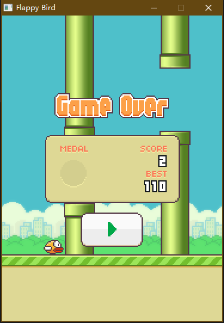

# FlappyBird

Flappy Bird game implemented in VB6, completed in February 2014.

用 VB6 实现的 Flappy Bird, 完成于 2014 年二月 (大概高一).

这个时候的 VB6 编程水平已经基本纯熟了, 包括变量命名和代码风格都相对比较科学.

程序根据 Flappy Bird 原作者在 App Store 里上传的最后一个版本的 Flappy Bird 制作, 图像和声音资源均来自于原游戏. 这个程序只使用了 VB 内置的 PaintPicture 函数来画图, 没有用 GDI(P) 或者 DX, 所以效率不高. 不过好在还能玩, 只是帧率比较低.

后来这个程序被我放到班里的电脑上, 然后改成了可以用 PPT 翻页遥控器玩.

## Copyright and License

Copyright (C) 2010-2012 MaxXSoft (MaxXing). License GPLv3.
